# A Ride to Adapt

> A Ride to Adapt is a website that helps foreigners to easily adapt to their new environment in Berlin, Germany. The website seeks to bring together foreigners who find it difficult to adapt through sporting activities like cycling, hiking, table and long tennis, motorsports and surfing. This is to bring them the feeling of belongingness even in a new environment and also have fun while they excercise to keep them healthy.

>The site is very useful for foreigners in Berlin to have a sense of association and helps users to quickly find solution to adpatation problems ranging from immigration to housing by dialing our hotline.
View the live website [here] (https://samuelandersoncodes.github.io/a-ride-to-adapt/)

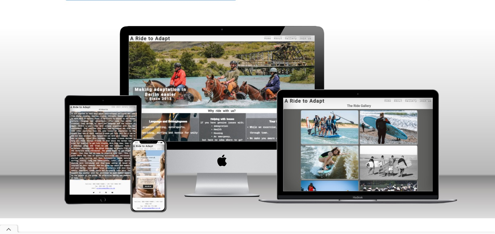

## Features

### Existing Features

* Navigation bar
    * Featured on all four pages, the full responsive navigation bar containing links to the Logo, Home, About, Gallery and Join-us 
      pages and is identical in each page to allow for easy navigation. 
    * This will allow users to easily navigate between the pages within the site on all screen sizes without the need for a 'back' 
      button.


* The landing page image
    * The landing page has a photograph with a text overlay to let the user know the exact location of this website's use and 
      activities. 
    * It also introduces the user to the website with an eye catching animation to grab their attention. 

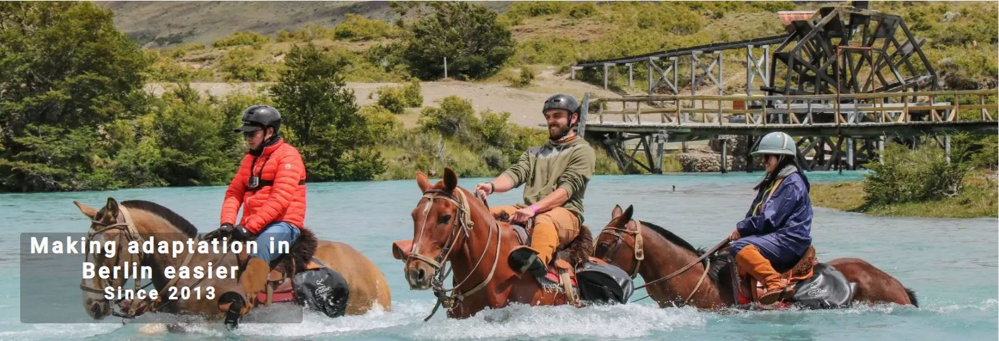

* The Reasons section
    * This section informs the user on the benefits of joining the international community not only in the area of sports and recreation 
      but also solve their adaptation-related promlems. 
    * This, coupled with the sense of belongingness should encourage the user to consider joining the international community.

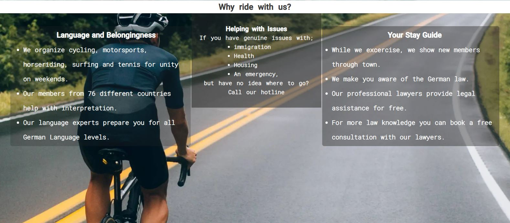

* The Activities section
    * The activities section allows the user to know the exact day and time an activity of interest is scheduled.
    * This section will be updated accordingly when more events are added or in case of future time changes.


* Our Center and Meeting Place
    * This section has an embedded map that directs the user straight to our location. 

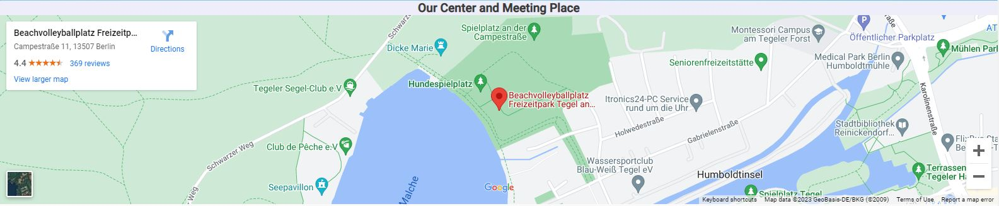

* Footer
    * The footer has links to the relevant social media hanldles. These links will open in a new tab to allow easy navigation for the   user.
    * The footer also includes two hotlines and an email that will enhance a faster communication form for the user in cases of urgency.
    * The footer is identical and consistent on all four pages making it easy for the user to use no matter the page they move to. 

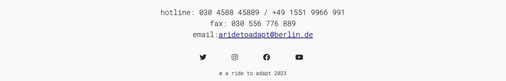

* The About page
    * This page informs the user on exactly how and when this international community was formed and its operations.
    * It also talks about the benefits and ideology of the community in details.

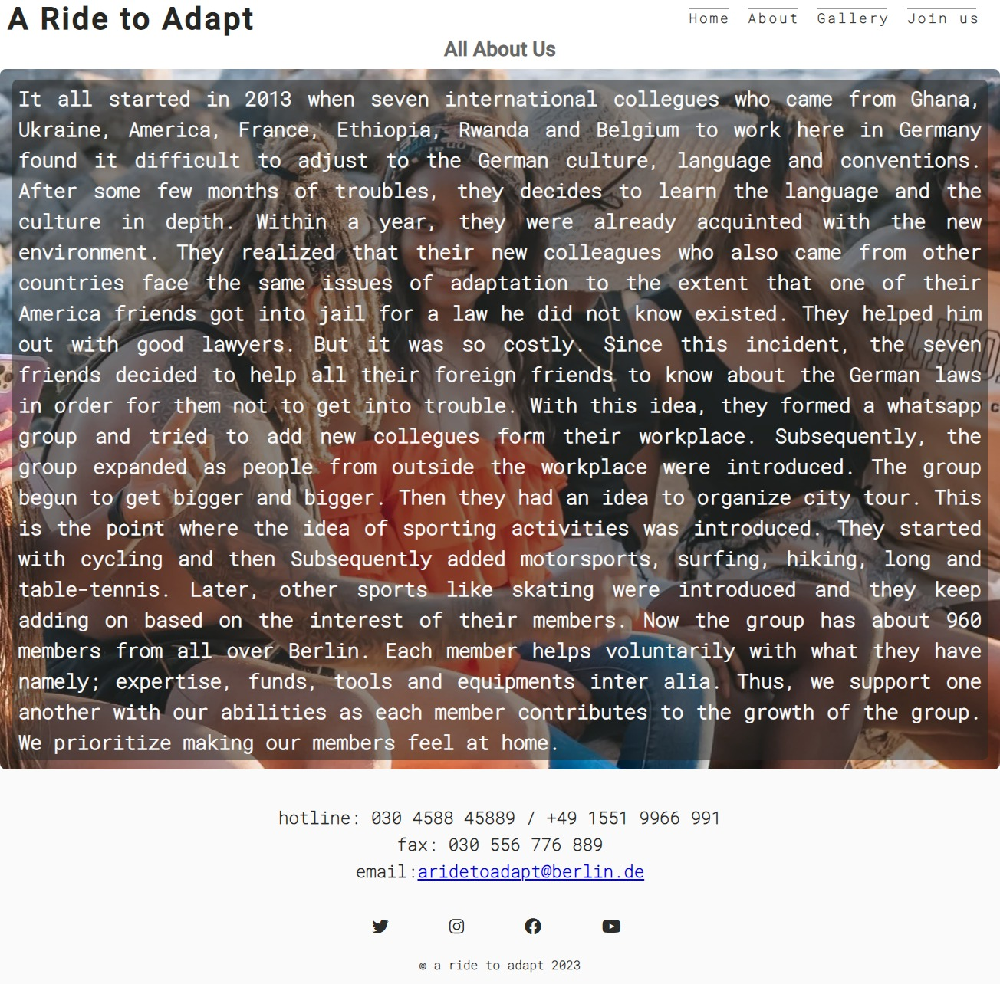

* Gallery
    * The gallery will provide the user with supporting images to see how our activities look like.
    * This section is valuable to the user as they will be able to easily identify the types of events the community puts together.

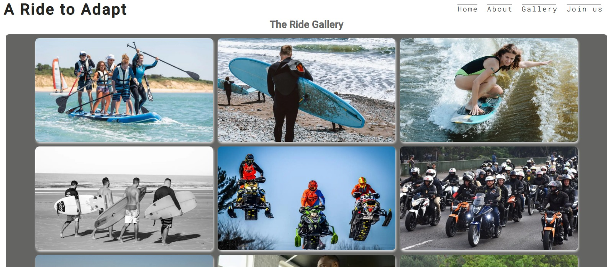

* Join-us page
    * The Join-us page allows the user to join our community and its activities by filling a form.
    * The user will be able to select the type of membership and sports they prefer while they fill in their name and email address 
      within the input fields below;

        * First Name (required, type=text)
        * Last Name (required, type=text)
        * E-mail (required, type=email)
        * Sport Type (required, type=text)
        * Membership type (required, type=radio)

    * On successful submission of the contact form, the user will be navigated to contact.html displaying a success message.
    * In cases of urgency, a hotline is provided on the contact confirmation page that shows after a successful form submission. 
    * These will also allow the user to contact us if they have any enqueiries about our activities and services.
    

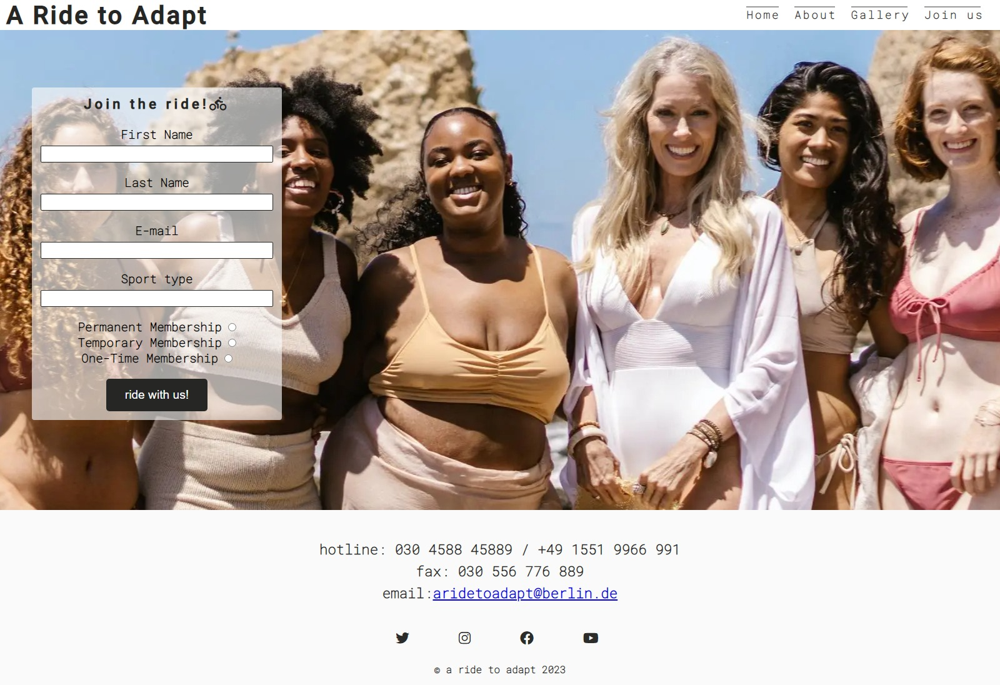

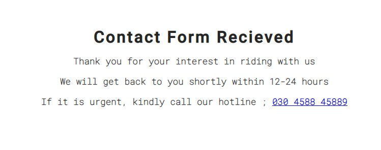

### Features Left to Implement

* As a future enhancement, the contact form will be updated with javascript in order for the user to recieve an alert on submission 
  instead of a contact form recieved page.

## Design

### Wireframes
<br>
Home page
<br><br>

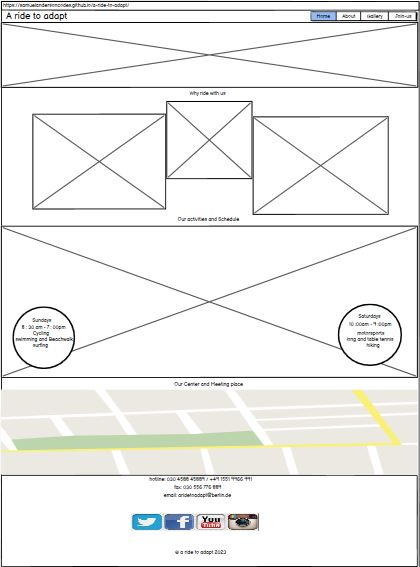

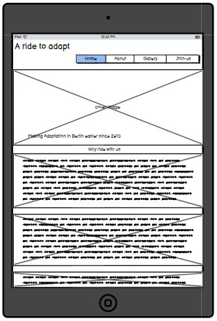

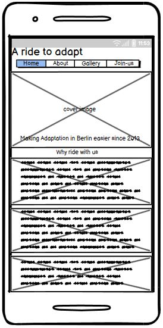

<br><br>
About Page
<br><br>

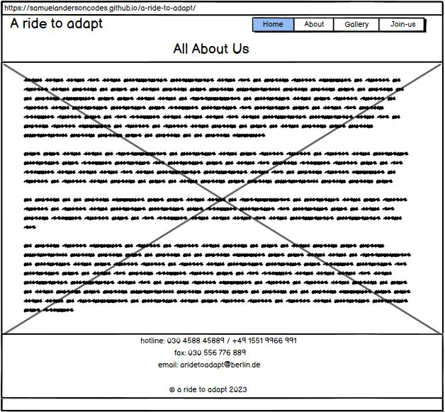

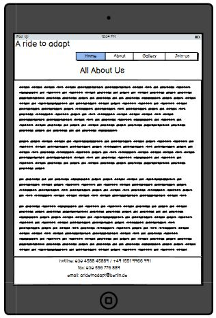

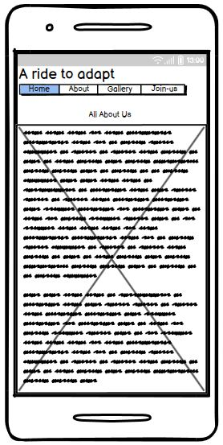

<br><br>
Gallery Page
<br><br>

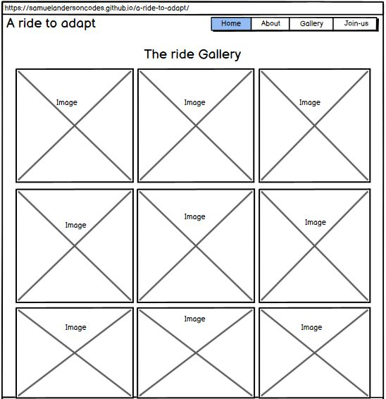

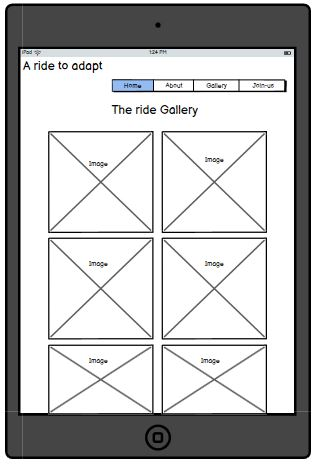

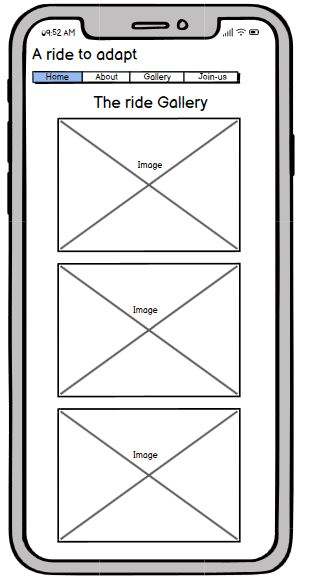
 
<br><br>
Join-us Page
<br><br>


 
<br><br>
Contact-Form-Recieved Page
<br><br>

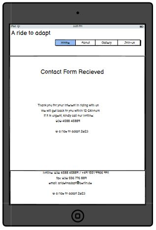

<br><br>
## Testing 

### Responsiveness

All pages were tested to ensure responsiveness on screen sizes of 320px and above as defined in [WCAG 2.1 Reflow criteria for responsive design](https://www.w3.org/WAI/WCAG21/Understanding/reflow.html) on Chrome, Edge, Firefox and Opera browsers.

Steps to test:

1. Open browser and navigate to [A Ride to Adapt]( https://samuelandersoncodes.github.io/a-ride-to-adapt/)
2. Open the developer tools ( tap the F12 key or right click and click on inspect)
3. Set to responsive and decrease width to 320px
4. Set the zoom to 50%
5. Click and drag the responsive window to maximum width

* Expected;

The website is responsive on all screen sizes and no images are pixelated or stretched.
No horizontal scroll is present.
No elements overlap.

* Actual;

Website works exactly as expected.

The website was opened on the following devices and no responsive issues were found;

- Iphone 10
- Iphone 12
- Iphone 13
- Iphone 6S plus
- Xiomi Redme 11 pro
- Samsung A 12
- Samsung Galaxy 20
- Samsung Galaxy Tab S7
- Infinix Hot 10
- Infinix Hot 12
- Asus Sonicmaster
- Hp EliteBook 8440p

### Accessibility

[Wave Accessibility](https://wave.webaim.org/report#/https://samuelandersoncodes.github.io/a-ride-to-adapt/) tool was used throughout the development process and for the final testing of the deployed website to test for aid accessibility.

The test was aimed at ensuring the following criteria were met:

- All forms have associated labels or aria-labels so that this is read out on a screen reader to users who tab to form inputs.
- Color contrasts meet a minimum ratio as specified in [WCAG 2.1 Contrast Guidelines](https://www.w3.org/WAI/WCAG21/Understanding/ 
  contrast-minimum.html)
- Heading levels are not missed or skipped to ensure the importance of content is relayed correctly to the end user.
- All content is contained within landmarks to ensure ease of use for assistive technology, allowing the user to navigate by page regions.
- All non-textual content had alternative text or titles so that descriptions can be read out to screen readers.
- HTML page lang attribute has been set.
- Aria properties have been implemented correctly.
- WCAG 2.1 Coding best practices are well followed.

Manual tests were also performed to ensure the website was accessible as possible.

### Lighthouse Testing

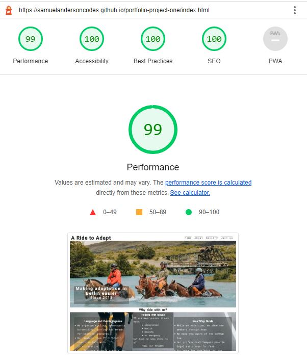

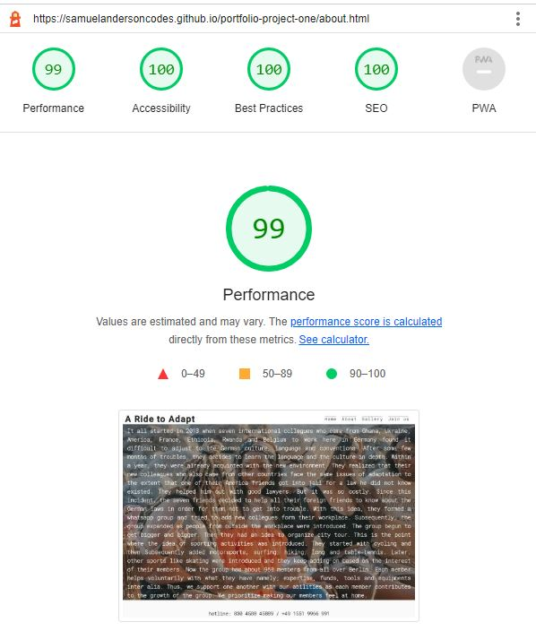

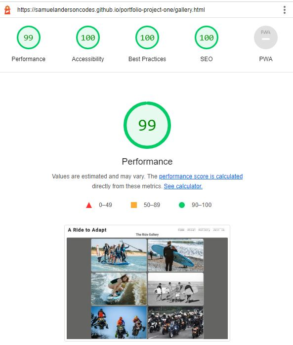

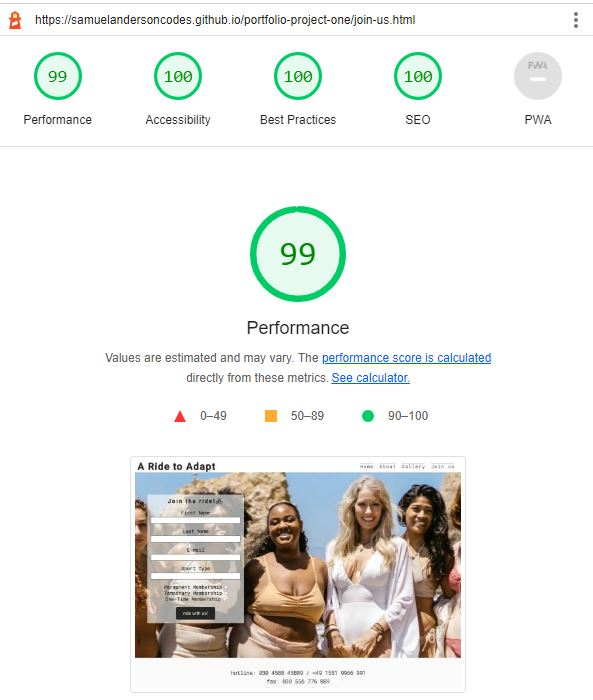

### Functional Testing

**Navigation Links**

Testing was performed to ensure all navigation links on the respective pages, navigated to the correct pages as per the design. This was done by clicking on the navigation links on each of the pages;

| Navigation Link | Page to Load    |
| --------------- | --------------- |
| Home            | index.html      |
| About           | about.html       |
| Gallery         | gallery.html    |
| Join-us         | join-us.html    |

Links on all the pages navigated to the exact allocated page without error.

**Form Testing**

The form on the home page was tested to ensure it functioned as expected. Both correct data and incorrect data were tested. The following test scenarios were covered:

* Scenario One - Correct Input data;

Steps to test:

1. Navigate to [A Ride to Adapt - Home Page]( https://samuelandersoncodes.github.io/a-ride-to-adapt/)
2. Click on Join-us in the navbar and input the following data:
   - First Name : Samuel
   - Last Name : Anderson
   - E-mail : aridetoadapt@berlin.de
   - Sport type : cycling
   - Membership choice : permanent membership
3. Click on the "ride with us" button. 
4. User will be redirected to contact.html. Thus, Contact Form Recieved page.

Expected:

Form submits with no warnings or errors and user is redirected to contact.html / Contact Form Recieved page.

Actual:

Website behaved as expected with no errors or warnings and redirected to contact.html.

* Scenario Two - Missing a Required Field; E-mail

Steps to test:

1. Navigate to [A Ride to Adapt - Home Page]( https://samuelandersoncodes.github.io/a-ride-to-adapt/)
2. Click on Join-us in the navbar and input the following data:
   - First Name: Samuel
   - Last Name: Anderson
   - Email: (missing)
   - Sport type: cycling
   - Membership choice : permanent membership
3. Click on the "ride with us" button.
4. User will be prompted by a (please fill out this field) message.

Expected:

The form does not submit and a prompt alert is displayed to tell the user that the field is required.

Actual:

Website behaved as expected, the error alert message was displayed and the form did not submit.

* Scenario Two (Repeated for other fields)
  * Scenario Two was repeated for the;
  - First Name
  - Last Name
  - Sport Type 
  - and the Membership radio fields

* The same results were achieved. 
* Thus, if a user misses any of the required fields, they will be prompted by an alert to fill in the exact field they left out.
* This is to ensure that users provide accurate data. 


**Footer Contact Information (email address)**

The email address in the contact information section of the footer was tested to ensure  that the behaviour was as expected.

* Steps to test email address

1. Navigate to [A Ride to Adapt - Home Page]( https://samuelandersoncodes.github.io/a-ride-to-adapt/)
2. Scroll down to the footer.
3. Click on the email address; aridetoadapt@berlin.de.

Expected:

The user's default email application opens with a page ready for a message input.

Actual:

Behavior was as expected. The outlook application was opened and ready to send an email to the target address.

**Footer Social Media Links**

Testing was conducted on the Font Awesome Social Media icons in the footer to ensure that each one of them opened in a new tab.

* Steps to test social media links

1. Navigate to [A Ride to Adapt - Home Page]( https://samuelandersoncodes.github.io/a-ride-to-adapt/)
2. Scroll down to the footer.
3. Click on a social media icon (twitter, instagram, facebook or youtube).

Expected:

Each of the icons opens up the respective social media page in a new tab.

Actual:

Behavior was as expected. 


**Contact Form Recieved Page**

* Steps to test Telephone Number

1. Navigate to [A Ride to Adapt - Home Page]( https://samuelandersoncodes.github.io/a-ride-to-adapt/)
2. After a form is rightfully filled on the Join-us page, user is redirected to a confirmation page upon clicking the ride with us button.
3. The user has to click on the hotline: (030 4588 45889) in case of urgency.

Expected:

A window is opened asking which device you would like to call from.

Actual:

Behavior was as expected and the window presents the user with the options of available applications to call from or send the number to their phone through the browser.

**Our Center and Meeting place Section Map**

Testing was conducted on the map right above the footer to ensure that it redirects the user to google maps in a new tab.

* Steps to test the map

1. Navigate to [A Ride to Adapt - Home Page]( https://samuelandersoncodes.github.io/a-ride-to-adapt/)
2. Scroll down to the Our Center and Meeting Place section right above the footer.
3. Click on the 'Directions' part of the map.

Expected:
The map opens in a new tab into google maps.

Actual:

Behavior was exactly as expected. 

### Validator Testing 

* HTML
  - No errors were returned when passing through the official [W3C validator](https://validator.w3.org)

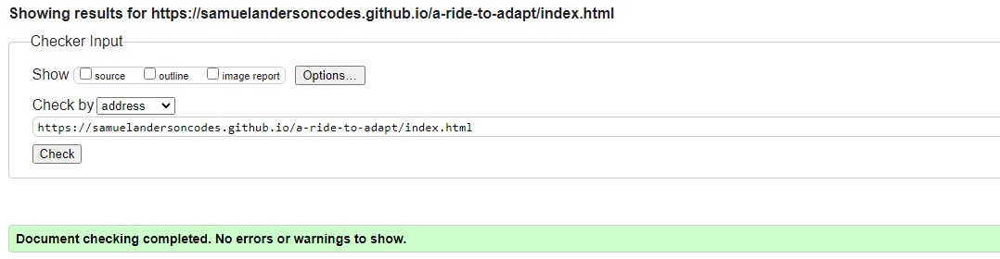

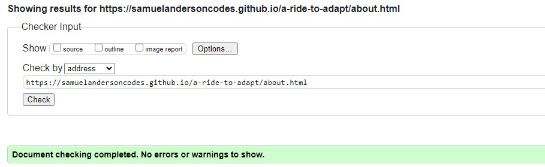

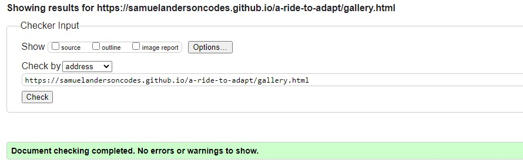

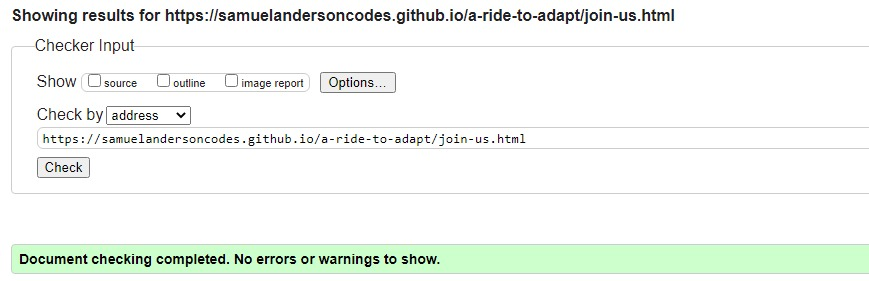

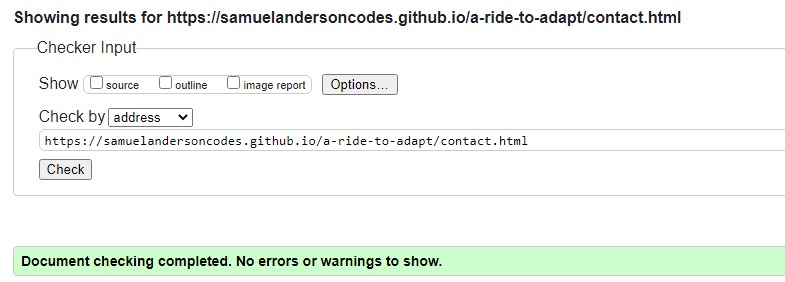

* CSS
  - No errors were returned when passing through the official [Jigsaw validator](https://jigsaw.w3.org)
  
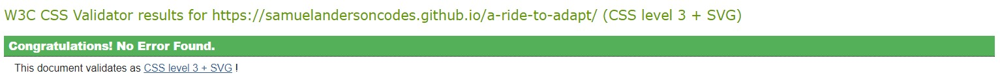


### Unfixed Bugs
The website worked on all devices, screen sizes and orientation. But on one particular Iphone 6S plus during the testing, the navbar has its join-us page link not being in line with the rest as expected. I checked on my media query and responsiveness adjustment again. Everything was perfect. After testing it on another phone of the same model, the site worked as expected. I have no clue what the bug might be. I am still researching on how to resolve this in a future release.

## Deployment

### Version Control

The site was created using the Visual Studio code editor on Gitpod and pushed to github to the remote repository ‘a-ride-to-adapt’.

The following git commands were used throughout the development to push code to the remote repository:

```git add .``` - This command was used to add the file(s) to the staging area before they are committed.

```git commit -m “commit message”``` - This command was used to commit changes to the local repository queue ready for the final step.

```git push``` - This command was used to push all committed code to the remote repository on github.

```git commit --amend -m "Amended git commit message"``` - This command was used to correct mistakenly/misspelt pushed commit messages.

```git push -f"``` - This command was used to force push an amended commit message.


### Deployment to Github Pages

- This website was deployed to GitHub pages. The steps to deploy are as follows; 
  - In the GitHub repository, navigate to the Settings tab 
  - From the menu on the left select 'Pages'
  - From the source section drop-down menu, select the main branch.
  - Click 'Save'
  - Refresh the page after a moment.
  - A live link will be displayed when published successfully.
  

This is the live link ; https://samuelandersoncodes.github.io/a-ride-to-adapt/ 

## Credits 

* [Code Institute](https://github.com/Code-Institute-Org/gitpod-full-template)
  * I appreciate Code institute's support and their gitpod template.

* [Font Awesome](https://fontawesome.com/icons)
    * Code was used from this website to create the social media icons in the footer and the bycycle icon at the end of the header on the form of the Join-us page.
    * Styles were changed to suit styling on the Website.

* [Google Fonts](https://fonts.google.com/)
    * The fonts (Roboto and Roboto Mono) used on this website were imported from google fonts.

* [Youtube Mockup Generation Tutorial](https://www.youtube.com/watch?v=TZDICT1Nw40&t=422s)
    * The mockups in the readme file were inspired by this video encouraging the use of techsini.com.
<br><br>
* Persons
    * A big appreciation to Gareth Mcgirr who recommended flexbox to me for a better responsive website.
    All images were optimized with inspiration his advise on using webp instead of jpg files. I converted my jpg images into webp file to optimize my website perfomance.

    * I thank Olena Olkhovyk for inspiring me and giving me ideas to add a gallery page.

### Content 

All the content with the exception of those listed in the Media and credits sections of this document were originaly made by Samuel Anderson.

### Media
  * The images in the gallery and backgroud images were downloaded from unsplash, pixabay, istock and splitshire. 
  * The Map at the Our Center and Meeting Place was imported from google maps.
  * The social media icons in the footer and the bicycle icon at the end of the header on the form of the Join-us page were imported from Font Awesome.
  * The images were converted from jpg to webp with the use of https://pixlr.com/x/ , https://cloudconvert.com/jpg-to-webp and https://convertio.co/jpg-webp/


