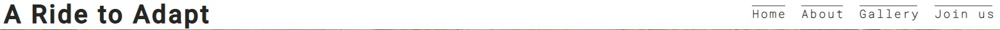

# A Ride to Adapt

> A Ride to Adapt is a website that helps foreigners to easily adapt to their new environment in Berlin, Germany. The website seeks to bring together foreigners who find it difficult to adapt through sporting activities like cycling, hiking, table and long tennis, motorsports and surfing. This is to bring them the feeling of belongingness even in a new environment and also have fun while they excercise to keep them healthy.

>The site is very useful for foreigners in Berlin to have a sense of association and helps users to quickly find solution to adpatation problems ranging from immigration to housing by dialing our hotline.
View the live website [here] (https://samuelandersoncodes.github.io/portfolio-project-one/)

## Features

### Existing Features

* Navigation bar
    * Featured on all four pages, the full responsive navigation bar containing links to the Logo, Home, About, Gallery and Join-us 
      pages and is identical in each page to allow for easy navigation. 
    * This will allow users to easily navigate between the pages within the site on all screen sizes without the need for a 'back' 
      button.

* The landing page image
    * The landing page has a photograph with a text overlay to let the user know the exact location of this website's use and 
      activities. 
    * It also introduces the user to the website with an eye catching animation to grab their attention. 

* The Reasons section
    * This section informs the user on the benefits of joining an international community not only in the area of sports and recreation 
      but also solve their adaptation-related promlems. 
    * This, coupled with the sense of belongingness should encourage the user to consider joining the international community.

* The Activities section
    * The activities section allows the user to know the exact day and time an activity of interest is scheduled.
    * This section will be updated accordingly when more events are added or in case of future time changes.

* Our Center and Meeting Place
    * This section has an embedded map that directs the user straight to our location. 

* Footer
    * The footer has links to the relevant social media hanldles. These links will open to a new tab to allow easy navigation for the   user.
    * The footer also includes two hotlines and an email that will enhance a faster communication form for the user in cases of urgency.
    * The footer is identical and consistent on all four page making it easy for the user to use no matter the page the move to. 

* The About page
    *This page informs the user on exactly how and when this international community was formed and its operations.
    *It also talks about the benefins and ideology of the community in details.

* Gallery
    * The gallery will provide the user with supporting images to see how our activities look like.
    * This section is valuable to the user as they will be able to easily identify the types of events the community puts together.

* Join-us page
    * The Join-us page allows the user to join our community and its activities by filling a form.
    * The user will be able to select the type of membership and sports they prefer while they fill in their name and email address 
      within the input fields below;

        * First Name (required, type=text)
        * Last Name (required, type=text)
        * Email (required, type=email)
        * Sport Type (required, type=text)
        * Membership type(required, type=radio)

    * On successful submission of the contact form, the user will be navigated to contact.html displaying a success message.
    * This will allow the user to contact if they have any queiries about travel destinations, charity events, club information or  
      maybe to join him on some of his travels.

### Features Left to Implement

* As a future enhancement, the contact form will be updated with javascript in order for the user to recieve an alert on submission 
  instead of a contact form recieved page.
 

